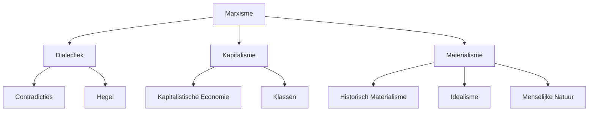

---
children:
  - "[[Kapitalisme]]"
  - "[[Dialectiek]]"
  - "[[Materialisme]]"
---
<!-- id: generated mindmap -->

```mermaid
graph TD
L1[Marxisme]
L2[Dialectiek]
L3[Contradicties]
L4[Hegel]
L5[Kapitalisme]
L6[Kapitalistische Economie]
L7[Klassen]
L8[Materialisme]
L9[Historisch Materialisme]
L10[Idealisme]
L11[Menselijke Natuur]
L1 --> L2
L1 --> L5
L1 --> L8
L2 --> L3
L2 --> L4
L5 --> L6
L5 --> L7
L8 --> L9
L8 --> L10
L8 --> L11
class L2,L3,L4,L5,L6,L7,L8,L9,L10,L11 internal-link; 
```
<!-- end: generated mindmap -->
# Summary

# Video's

# Lesson plans

