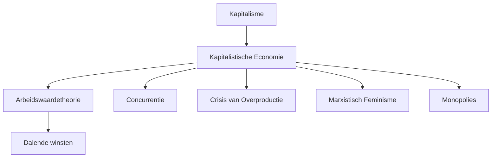

<!-- id: generated mindmap -->

```mermaid
graph TD
L1[Kapitalisme]
L2[Kapitalistische Economie]
L3[Arbeidswaardetheorie]
L4[Dalende winsten]
L5[Concurrentie]
L6[Crisis van Overproductie]
L7[Marxistisch Feminisme]
L8[Monopolies]
L1 --> L2
L2 --> L3
L2 --> L5
L2 --> L6
L2 --> L7
L2 --> L8
L3 --> L4
class L1,L2,L4,L5,L6,L7,L8 internal-link; 
```
<!-- end: generated mindmap -->

# Summary

# Video's

# Lesson plans

