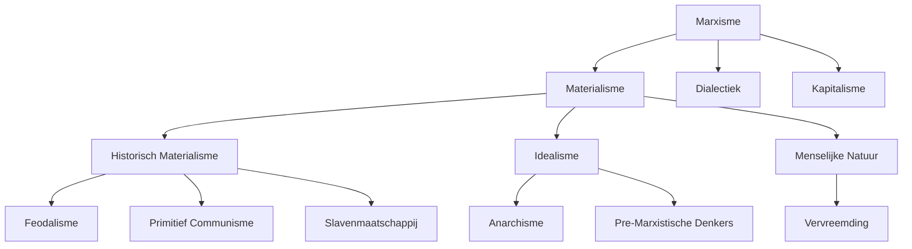

<!-- id: generated mindmap -->

```mermaid
graph TD
L1[Marxisme]
L2[Materialisme]
L3[Historisch Materialisme]
L4[Feodalisme]
L5[Primitief Communisme]
L6[Slavenmaatschappij]
L7[Idealisme]
L8[Anarchisme]
L9[Pre-Marxistische Denkers]
L10[Menselijke Natuur]
L11[Vervreemding]
L12[Dialectiek]
L13[Kapitalisme]
L1 --> L2
L1 --> L12
L1 --> L13
L2 --> L3
L2 --> L7
L2 --> L10
L3 --> L4
L3 --> L5
L3 --> L6
L7 --> L8
L7 --> L9
L10 --> L11
class L1,L3,L4,L5,L6,L7,L8,L9,L10,L11,L12,L13 internal-link; 
```
<!-- end: generated mindmap -->

# Summary

# Video's

# Lesson plans

